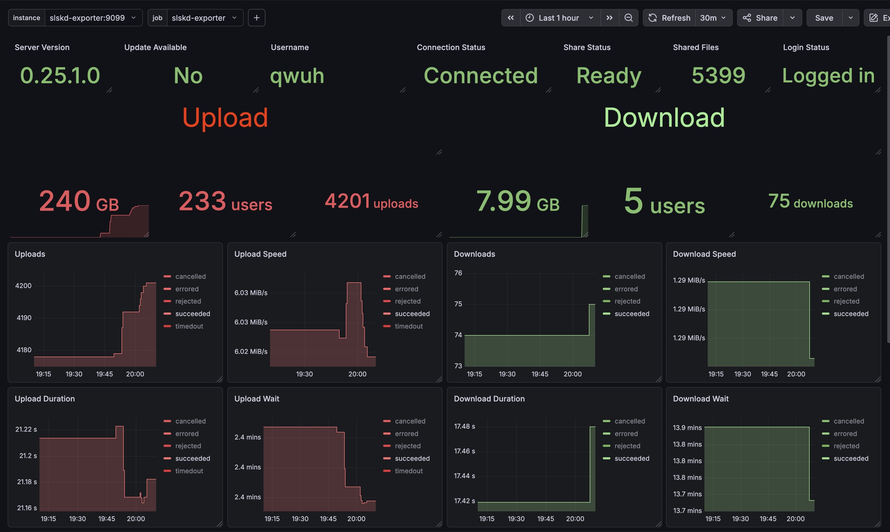

# slskd-exporter

<div align="center">
  
  <h1 style="font-size: 28px; margin: 10px 0;">slskd-exporter</h1>
  <p>A Prometheus exporter for slskd</p>
</div>
<br>

## Usage

### Docker Compose (recommended)

```yaml
services:
  slskd-exporter:
    build: .
    container_name: slskd-exporter
    restart: unless-stopped
    ports:
      - "9099:9099"
    environment:
      SLSKD_HOST: "https://slskd.example.com"
      SLSKD_API_KEY: # optional
      SLSKD_EXPORTER_PORT: 9099
      SLSKD_EXPORTER_INTERVAL: 30
```

### CLI

Requires [uv](https://docs.astral.sh/uv/):

```sh
uv sync
uv run slskd-exporter --host http://localhost:5030
```

Metrics are served at `http://localhost:9099/metrics`.

## Metrics

Scrapes the following slskd API endpoints:

| Endpoint                                      | Metrics                                                                                                                                                                                          |
| --------------------------------------------- | ------------------------------------------------------------------------------------------------------------------------------------------------------------------------------------------------ |
| `/api/v0/application`                         | Version info, server connection state, watchdog, VPN, relay, search health (latency, queue depth, drop rate), user statistics (speed, directories, files, uploads), share status & scan progress |
| `/api/v0/conversations`                       | Total conversation count, total unacknowledged messages                                                                                                                                          |
| `/api/v0/telemetry/reports/transfers/summary` | Transfer bytes, count, distinct users, average speed, average wait, average duration — labeled by direction and status                                                                           |

## Configuration

All options can be set via CLI flags or environment variables:

| Flag                 | Env var                    | Default                 | Description                                        |
| -------------------- | -------------------------- | ----------------------- | -------------------------------------------------- |
| `--host` / `-h`      | `SLSKD_HOST`               | `http://localhost:5030` | Base URL of the slskd instance                     |
| `--api-key` / `-k`   | `SLSKD_API_KEY`            | _(empty)_               | API key (only needed if authentication is enabled) |
| `--port` / `-p`      | `SLSKD_EXPORTER_PORT`      | `9099`                  | Port to expose metrics on                          |
| `--interval` / `-i`  | `SLSKD_EXPORTER_INTERVAL`  | `30`                    | Scrape interval (seconds)                          |
| `--log-level` / `-l` | `SLSKD_EXPORTER_LOG_LEVEL` | `INFO`                  | Logging level                                      |

## Grafana Dashboard

See the `grafana` folder.

## Prometheus Configuration

example prometheus scrape config:

```yaml
scrape_configs:
  - job_name: "slskd-exporter"
    scrape_interval: 30s
    metrics_path: /metrics
    static_configs:
      - targets: ["slskd-exporter:9099"]
```
